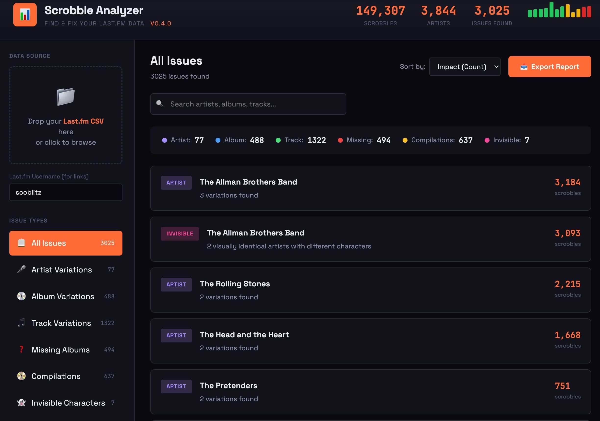

# Scrobble Analyzer

**Find and fix data quality issues in your Last.fm scrobble history.**

After 20 years of scrobbling and 150,000+ plays, I discovered my Last.fm data was full of invisible inconsistencies - artist name variations, album duplicates, tracks scattered across remastered editions, and even entries that *looked* identical but contained hidden Unicode characters. These issues were silently skewing my stats the whole time.

I couldn't find any tool that surfaced these problems, so I built one.

## What It Does

Scrobble Analyzer examines your Last.fm export and identifies:

- **Artist Variations** - "The Allman Brothers Band" vs "Allman Brothers Band" vs "The Allman Brothers Band" (with invisible characters!)
- **Album Variations** - "Abbey Road" vs "Abbey Road (Super Deluxe Edition)" vs "Abbey Road (2019 Remaster)"
- **Track Variations** - "Statesboro Blues" vs "Statesboro Blues (Live)" vs "Statesboro Blues - Remastered"
- **Missing Albums** - Tracks that were scrobbled without album information
- **Compilations** - Plays on "Greatest Hits" albums that could be reassigned to original releases
- **Invisible Characters** - Entries that look identical but contain non-breaking spaces or other hidden Unicode characters
- **Smart Quote Variations** - "Don't" (Unicode) vs "Don't" (ASCII) - common when copying from MusicBrainz

Issues are sorted by impact (scrobble count) so you can fix the biggest problems first.

Each variation includes a direct link to your Last.fm library (with `+noredirect` to prevent auto-redirects) so you can quickly navigate to fix issues.

## How To Use It

### **→ [Launch Scrobble Analyzer](https://scoblitz.github.io/scrobble-analyzer)** 
*Recommended - always up to date*

Or [download index.html](index.html) to run locally (note: you won't receive updates)

### Getting Your Data

1. Go to [lastfmstats.com](https://lastfmstats.com/) 
2. Enter your Last.fm username and let it load your data
3. Use the Export feature to download your scrobble history as CSV
4. Drop the CSV file into the upload area in Scrobble Analyzer

**Required CSV format:** Must have a header row with columns for `Artist`, `Album`, `Track`. The `AlbumId` column is optional but enables additional features.

## What It Found In My Data

From ~150,000 scrobbles over 20 years:

- **77 artist variation issues** - Including 7 entries with invisible characters
- **488 album variation issues** - Remasters, deluxe editions, and typos
- **600+ track variations** - 11 different versions of "Statesboro Blues" alone!
- **494 artists with missing album data** - ~6% of all scrobbles
- **637 compilation albums** - Plays that could be reassigned to original releases

I had no idea it was this messy. If you've been scrobbling for years, yours probably is too.

## Current Status

**Version 0.5.0** - Now with dismiss & persistence!

### What's New in v0.5.0

- **Dismiss issues** - Mark items as fixed or "won't fix" to hide them from view
- **Per-track dismissal** - For Missing Albums and Compilations, dismiss individual tracks (great for working through long lists over multiple sessions)
- **Persistence** - Dismissed items are remembered when you re-import the same file
- **View dismissed** - Toggle to review and restore dismissed items
- **Smart quote detection** - Catches Unicode vs ASCII apostrophe/quote variations
- **Better onboarding** - Instructions and "What's New" shown before file upload
- **Improved error handling** - Friendly messages for invalid file formats

### Current Limitations

- Analysis only (doesn't modify your Last.fm data directly - you'll use Last.fm's edit interface)
- Shows first 100 issues per category (use search/filters to find more)
- Persistence is per-file (importing a new export starts fresh)

## Roadmap Ideas

- [ ] MusicBrainz integration for canonical album/artist lookups
- [ ] Direct Last.fm API integration (skip the export step)
- [ ] Personal "discography" - mark canonical versions to check against future exports
- [ ] More detection patterns based on community feedback

## Stay Updated

Get notified when new versions are released:

📬 **[Subscribe to updates](https://buttondown.com/scrobble-analyzer)**

No spam, just release announcements and occasional project news.

## Feedback Welcome

This project came out of my own frustration with messy scrobble data. If you:

- Find bugs or issues
- Have ideas for new detection patterns
- Discover edge cases in your own data

Please [open an issue](../../issues) or start a [discussion](../../discussions)! I'd love to hear what problems you're finding in your data.

## Built With

This is a collaboration between a music data nerd (me) and Claude (Anthropic's AI assistant). The entire tool is a single HTML file with no dependencies - just open it in a browser.

## License

MIT License - Do whatever you want with it. If you build something cool, I'd love to hear about it.

---

*"It combines a few of my favorite things: music and data."*
