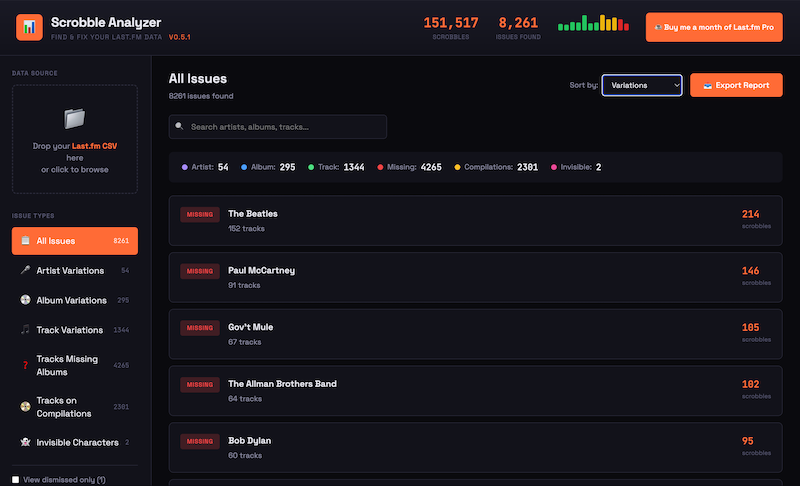

# Scrobble Analyzer

**Find and fix data quality issues in your Last.fm scrobble history.**

After 20 years of scrobbling and 150,000+ plays, I discovered my Last.fm data was full of invisible inconsistencies - artist name variations, album duplicates, tracks scattered across remastered editions, and even entries that *looked* identical but contained hidden Unicode characters. These issues were silently skewing my stats the whole time.

I couldn't find any tool that surfaced these problems, so I built one.

## What It Does

Scrobble Analyzer examines your Last.fm export and identifies:

- **Artist Variations** - "The Allman Brothers Band" vs "Allman Brothers Band" vs "The Allman Brothers Band" (with invisible characters!)
- **Album Variations** - "Abbey Road" vs "Abbey Road (Super Deluxe Edition)" vs "Abbey Road (2019 Remaster)"
- **Track Variations** - "Statesboro Blues" vs "Statesboro Blues (Live)" vs "Statesboro Blues - Remastered"
- **Tracks Missing Albums** - Tracks that were scrobbled without album information
- **Tracks on Compilations** - Plays on "Greatest Hits" albums that could be reassigned to original releases
- **Invisible Characters** - Entries that look identical but aren't: non-breaking spaces, zero-width characters, doubled spaces, and other hidden differences in artists, albums, and tracks. Each one is revealed with a labeled chip (like `NBSP` or `2×SP`) showing exactly which character is hiding where.
- **Smart Quote Variations** - "Don't" (Unicode) vs "Don't" (ASCII) - common when copying from MusicBrainz

Issues are sorted by impact (scrobble count) so you can fix the biggest problems first.

Each variation includes a direct link to your Last.fm library (with `+noredirect` to prevent auto-redirects) so you can quickly navigate to fix issues, plus Google lookup buttons for researching ambiguous cases.

**Your dismissals stick.** Marked something as "not actually a problem"? That dismissal is remembered across new exports - tied to your Last.fm username, stored only in your browser. Re-export next month and pick up right where you left off.

**Everything happens in your browser.** Your scrobble data is never uploaded anywhere - the analysis runs entirely on your machine.

## How To Use It

### **→ [Launch Scrobble Analyzer](https://scoblitz.github.io/scrobble-analyzer)**
*Recommended - always up to date*

Or [download index.html](index.html) to run locally (note: you won't receive updates)

### Getting Your Data

1. Go to [lastfmstats.com](https://lastfmstats.com/)
2. Enter your Last.fm username and let it load your data
3. Use the Export feature to download your scrobble history as CSV
4. Drop the CSV file into the upload area in Scrobble Analyzer

**Required CSV format:** Must have a header row with columns for `Artist`, `Album`, `Track`, and `Date`. This is exactly what lastfmstats.com exports - no preparation needed.

## Current Status

**Version 0.6.0**

**v0.6.0 Release Summary**

**New Features:**
  - **Persistent dismissals** - Dismissals now survive new exports. They're keyed to your Last.fm username (read automatically from the export) instead of the uploaded file, and existing dismissals migrate automatically the first time you load a file.
  - **Character reveal** - Invisible characters and stray spaces display as labeled chips so you can see exactly what differs between identical-looking names. Hover a chip for the Unicode codepoint.
  - **Track-level invisible detection** - Tracks now get the same invisible-character scan artists and albums already had.
  - **Export options** - A checkbox under Export Report lets you include dismissed items (tagged `[DISMISSED]`). By default the report is your active to-do list.

**Improvements:**
  - **One issue, one category** - Variations that differ only by invisible characters now appear only under Invisible Characters instead of being double-listed as artist/album/track variations.
  - **Search & filter quality of life** - Clear button in the search box, reset button on the artist filter, and smoother search on large libraries.
  - **Visual refresh** - Calmer color usage, softer active states, warmer text. Orange is reserved for the header readout and actions instead of shouting from every card.

**Fixes:**
  - Titles that legitimately contain quotes (like Bowie's *"Heroes"*) no longer have them stripped during CSV parsing
  - Compilation detection no longer skips albums merely containing the word "gold" (ABBA's *Gold*, Sting's *Fields of Gold* collection, etc.)
  - Selecting the same file twice in a row via the file picker now works
  - A failed file read shows an error instead of loading forever
  - Loading a second file no longer silently keeps the previous file's artist filter

### Current Limitations

- Analysis only (doesn't modify your Last.fm data directly - you'll use Last.fm's edit interface)
- Shows first 100 issue cards per category (use search/filters to find more)
- Compilations spanning multiple track artists (e.g. an Eric Clapton compilation containing Cream tracks) appear split across those artists, because the export only carries the track artist
- The `AlbumId` column in the export is currently ignored - it turns out those IDs aren't always trustworthy (ask me about the two Clapton compilations sometime)

## Roadmap Ideas

- [ ] MusicBrainz integration for canonical album/artist verification and lookups
- [ ] Personal "discography" - mark canonical versions to check against future exports
- [ ] More detection patterns based on community feedback

## Stay Updated

Get notified when new versions are released:

📬 **[Subscribe to updates](https://buttondown.com/scrobble-analyzer)**

No spam, just release announcements and occasional project news.

## Feedback Welcome

This project came out of my own frustration with messy scrobble data. If you:

- Find bugs or issues
- Have ideas for new detection patterns
- Discover edge cases in your own data

Please [open an issue](../../issues) or start a [discussion](../../discussions)! I'd love to hear what problems you're finding in your data.

## Built With

This is a collaboration between a music data nerd (me) and Claude (Anthropic's AI assistant). The entire tool is a single HTML file with no dependencies - just open it in a browser.

## License

MIT License - Do whatever you want with it. If you build something cool, I'd love to hear about it.

---
