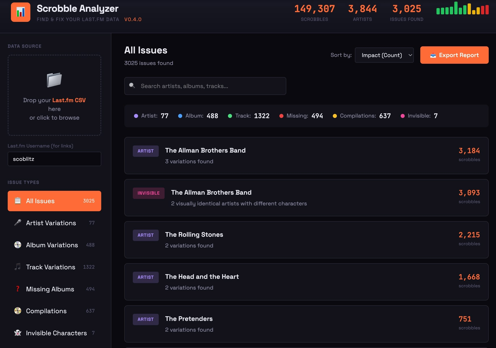

# Scrobble Analyzer

**Find and fix data quality issues in your Last.fm scrobble history.**

After 20 years of scrobbling and 150,000+ plays, I discovered my Last.fm data was full of invisible inconsistencies - artist name variations, album duplicates, tracks scattered across remastered editions, and even entries that *looked* identical but contained hidden Unicode characters. These issues were silently skewing my stats the whole time.

I couldn't find any tool that surfaced these problems, so I built one.

## What It Does

Scrobble Analyzer examines your Last.fm export and identifies:

- **Artist Variations** - "The Allman Brothers Band" vs "Allman Brothers Band" vs "The Allman Brothers Band" (with invisible characters!)
- **Album Variations** - "Abbey Road" vs "Abbey Road (Super Deluxe Edition)" vs "Abbey Road (2019 Remaster)"
- **Track Variations** - "Statesboro Blues" vs "Statesboro Blues (Live)" vs "Statesboro Blues - Remastered"
- **Missing Albums** - Tracks that were scrobbled without album information
- **Compilations** - Plays on "Greatest Hits" albums that could be reassigned to original releases
- **Invisible Characters** - Entries that look identical but contain non-breaking spaces or other hidden Unicode characters
- **Smart Quote Variations** - "Don't" (Unicode) vs "Don't" (ASCII) - common when copying from MusicBrainz

Issues are sorted by impact (scrobble count) so you can fix the biggest problems first.

Each variation includes a direct link to your Last.fm library (with `+noredirect` to prevent auto-redirects) so you can quickly navigate to fix issues.

## How To Use It

### **→ [Launch Scrobble Analyzer](https://scoblitz.github.io/scrobble-analyzer)** 
*Recommended - always up to date*

Or [download index.html](index.html) to run locally (note: you won't receive updates)

### Getting Your Data

1. Go to [lastfmstats.com](https://lastfmstats.com/) 
2. Enter your Last.fm username and let it load your data
3. Use the Export feature to download your scrobble history as CSV
4. Drop the CSV file into the upload area in Scrobble Analyzer

**Required CSV format:** Must have a header row with columns for `Artist`, `Album`, `Track`. The `AlbumId` column is optional but enables additional features.

## Current Status

**Version 0.5.1** 

**v0.5.1 Release Summary**

**New Features:**
  - **Google Search lookup buttons** - 🔍 Research buttons for artist variations (always shown) and album/track variations (only when they genuinely differ after stripping parenthetical items). Per-track lookup for Missing Albums and Compilations to find original album.
  - **Ko-fi support button** - "Buy me a month of Last.fm Pro" in header (after file load) and empty state

**Improvements:**
  - **Renamed sidebar items** - "Missing Albums" → "Tracks Missing Albums", "Compilations" → "Tracks on Compilations"
  - **Track-based counting** - Missing Albums and Compilations now count individual tracks, not artist groups. Header and sidebar totals updated accordingly.
  - **Compilation track counts** - Now shows scrobble count next to each track in compilation cards
  - **Smoother dismissals** - Item-level dismissals animate out without full page re-render; scroll position preserved on card dismissals
  - **Removed Artists stat from header** - Streamlined to just Scrobbles and Issues Found

### Current Limitations

- Analysis only (doesn't modify your Last.fm data directly - you'll use Last.fm's edit interface)
- Shows first 100 issues per category (use search/filters to find more)
- Persistence is per-file (importing a new export starts fresh)

## Roadmap Ideas

- [ ] MusicBrainz integration for canonical album/artist lookups
- [ ] Direct Last.fm API integration (skip the export step)
- [ ] Personal "discography" - mark canonical versions to check against future exports
- [ ] More detection patterns based on community feedback

## Stay Updated

Get notified when new versions are released:

📬 **[Subscribe to updates](https://buttondown.com/scrobble-analyzer)**

No spam, just release announcements and occasional project news.

## Feedback Welcome

This project came out of my own frustration with messy scrobble data. If you:

- Find bugs or issues
- Have ideas for new detection patterns
- Discover edge cases in your own data

Please [open an issue](../../issues) or start a [discussion](../../discussions)! I'd love to hear what problems you're finding in your data.

## Built With

This is a collaboration between a music data nerd (me) and Claude (Anthropic's AI assistant). The entire tool is a single HTML file with no dependencies - just open it in a browser.

## License

MIT License - Do whatever you want with it. If you build something cool, I'd love to hear about it.

---
